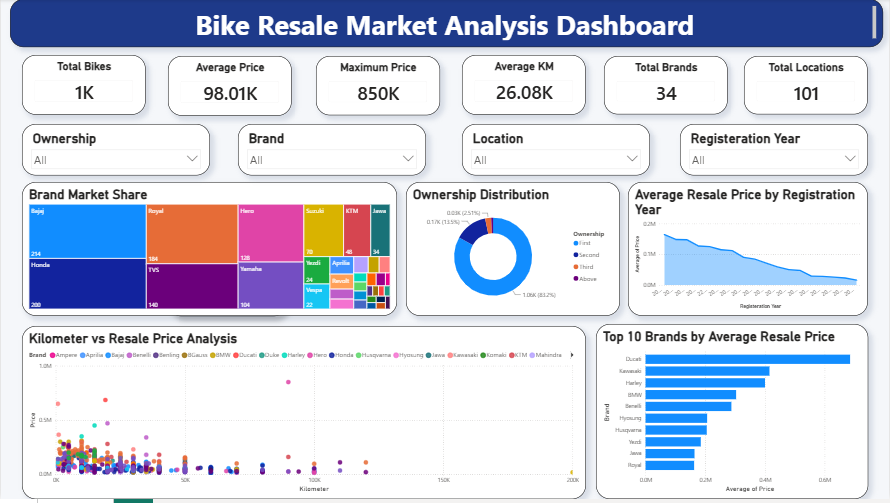

# 🚲 Bike Resale Price Analysis

An end-to-end **Data Analytics** project that collects real-world used bike listings through **Web Scraping**, performs **Exploratory Data Analysis (EDA)** using Python, and builds an interactive **Power BI Dashboard** to uncover resale market trends and business insights.

---

## 📊 Dashboard Preview



---

## 📌 Project Overview

This project analyzes the Indian used bike market by scraping data from **BikeKharido**, cleaning and transforming the dataset, performing exploratory data analysis, and visualizing insights using Power BI.

The dashboard enables users to understand the key factors influencing bike resale prices, including brand, ownership, registration year, mileage, and location.

---

## 🎯 Objectives

- Scrape used bike listings from BikeKharido
- Clean and preprocess raw data
- Perform Exploratory Data Analysis (EDA)
- Identify the major factors affecting resale prices
- Build an interactive Power BI dashboard
- Generate actionable business insights

---

## 🛠️ Tech Stack

| Category | Technologies |
|----------|--------------|
| Programming | Python |
| Web Scraping | Requests, BeautifulSoup |
| Data Processing | Pandas, NumPy |
| Visualization | Matplotlib, Seaborn |
| Dashboard | Power BI |
| Development | Jupyter Notebook |

---

## 📂 Dataset Information

The dataset contains **1,000+ used bike listings** collected through web scraping.

### Features

- Registration Year
- Brand
- Model
- Price
- Kilometer Driven
- Ownership
- Location
- Uploaded Date

---

## 📈 Dashboard KPIs

The dashboard includes:

- 🚲 Total Bikes
- 💰 Average Resale Price
- 📈 Maximum Price
- 🛣️ Average Kilometers Driven
- 🏍️ Total Brands
- 📍 Total Locations

### Interactive Filters

- Brand
- Ownership
- Location
- Registration Year

---

## 📊 Dashboard Visualizations

- Brand Market Share (Treemap)
- Ownership Distribution
- Average Resale Price by Registration Year
- Kilometer vs Resale Price Analysis
- Top 10 Brands by Average Resale Price

---

## 🔍 Key Business Insights

- First-owner bikes dominate the resale market.
- Premium brands command significantly higher resale prices.
- Newer bikes retain higher resale value.
- Higher mileage negatively impacts resale price.
- Metro cities contribute the largest share of bike listings.
- Ownership history significantly influences resale value.

---

## 📁 Repository Structure

```
Bike-Resale-Price-Analysis/
│
├── README.md
├── dashboard.png
├── bike_resale_analysis.ipynb
├── bike_resale_dashboard.pbix
├── bike_resale_data.csv
├── requirements.txt
├── .gitignore
└── LICENSE
```

---

## 🚀 How to Run

### 1. Clone the Repository

```bash
git clone https://github.com/Manohargujjula/Bike-Resale-Price-Analysis.git
```

### 2. Navigate to the Project Folder

```bash
cd Bike-Resale-Price-Analysis
```

### 3. Install Dependencies

```bash
pip install -r requirements.txt
```

### 4. Launch Jupyter Notebook

```bash
jupyter notebook
```

Open:

```
bike_resale_analysis.ipynb
```

You can also open the notebook directly using **Visual Studio Code**.

---

## 📊 Project Workflow

```
BikeKharido Website
          │
          ▼
   Web Scraping
          │
          ▼
 Data Cleaning & Preprocessing
          │
          ▼
 Exploratory Data Analysis
          │
          ▼
 Business Insights
          │
          ▼
 Power BI Dashboard
```

---

## 📈 Results

- Collected real-world bike listing data using web scraping.
- Cleaned and transformed the dataset for analysis.
- Performed Univariate, Bivariate, and Multivariate Analysis.
- Built an interactive Power BI dashboard for business decision-making.
- Identified major factors influencing resale prices.

---

## 🚀 Future Improvements

- Develop a Machine Learning model for resale price prediction.
- Automate data collection with scheduled web scraping.
- Publish the dashboard using Power BI Service.
- Integrate live market data for real-time analysis.

---

## 📚 Skills Demonstrated

- Web Scraping
- Data Cleaning
- Exploratory Data Analysis (EDA)
- Data Visualization
- Business Intelligence
- Power BI Dashboard Development
- Python Programming
- Business Insight Generation

---

## 👨‍💻 Author

**Manohar Gujjula**

B.Tech – Artificial Intelligence & Machine Learning

**Skills**

- Python
- SQL
- Power BI
- Pandas
- NumPy
- Machine Learning
- Data Analytics

---

## ⭐ Support

If you found this project helpful or interesting, consider giving it a **⭐ Star** on GitHub.
